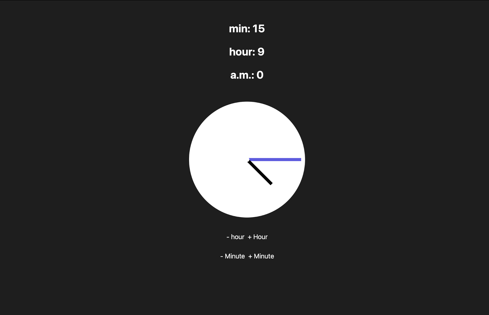
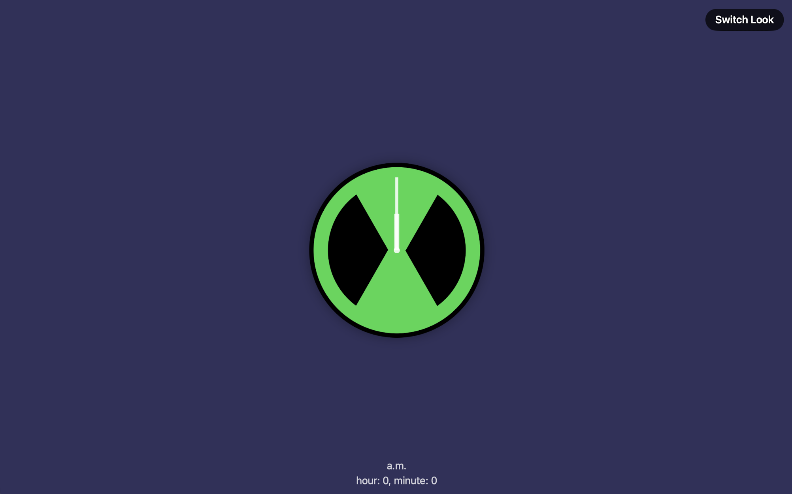
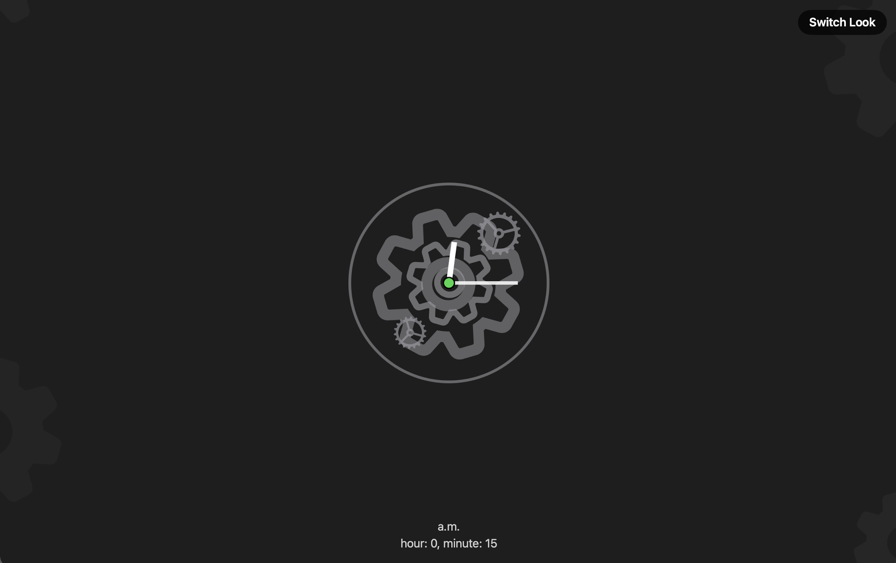
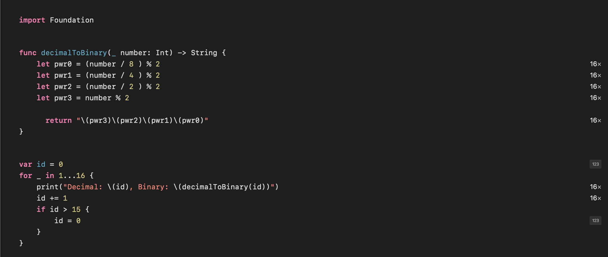
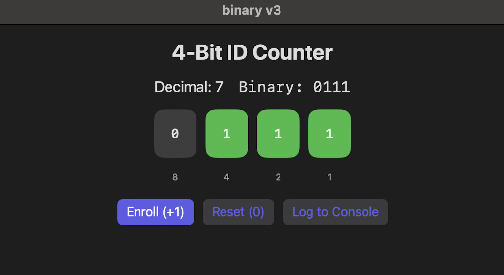

[home](README.md) | **[projects](projects.md)** | [documentation](documentation.md) | [big idea](bigidea.md)

# **PROJECTS**

 

## [Scratch](https://github.com/pptbasyurt/pelinbasyurt/tree/main/Projects/Block_Coding)

 ### - *[Tic-Tac-Toe](https://scratch.mit.edu/projects/1212524604)*
*a basic tic tac toe game*
  
 

  

 

## [Swift](https://github.com/pptbasyurt/pelinbasyurt/tree/main/Projects/Swift)

### - *[X-O-X grid](Projects/Swift/kutu_kutu_pense.swiftpm.zip)*
*3x3 tic-tact-toe grid of colorful boxes*
  
  

 -------------------------------------------------------------------------------------------------------------------------------------

### - *[Calculator](Projects/Swift/basit_hesap_makinesi.swiftpm.zip)*
*A simple calculator that gets user input and does the 4 arithmetical equations on them*

 

-------------------------------------------------------------------------------------------------------------------------------------

### - *[Menu-Bill](Projects/Swift/menu_hesabi.swiftpm.zip)*

-------------------------------------------------------------------------------------------------------------------------------------

### - *[My Portrait](Projects/Swift/my_portrait.swiftpm.zip)*
*me, coded*

-------------------------------------------------------------------------------------------------------------------------------------

### - *[Clock V1](Projects/Swift/clockv1.zip)*
*a clock that advances on click and changes background color based on whether its a.m. or p.m.*

 
 

 

### - *[Clock V2](Projects/Swift/clockv2.zip)*
*in addition to clock v2, the time can be changed using buttons on screen*

 

### - *[Clock V3 - Ominitrix](Projects/Swift/bentenwatch.swiftpm.zip)*
*BenTen's Ominitrix watch that shows the mechanics and inner mechanisms when clicked on the switch buttton*

 

-------------------------------------------------------------------------------------------------------------------------------------

### - *[Binary Conversion P1](Projects/Swift/binaryv2.zip)*

 

 

### - *[Binary Conversion P2](Projects/Swift/binaryv2.zip)*

