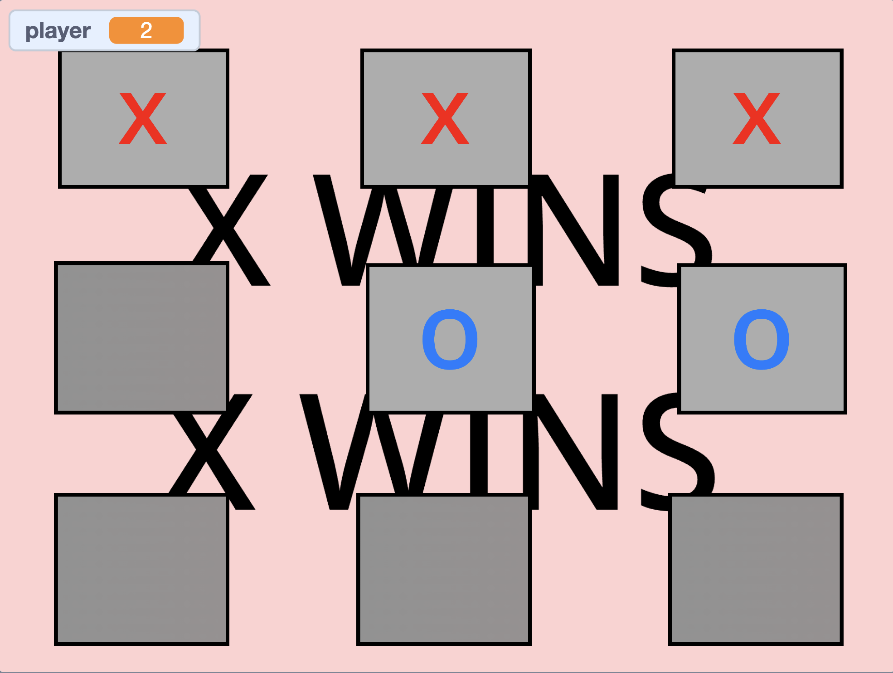
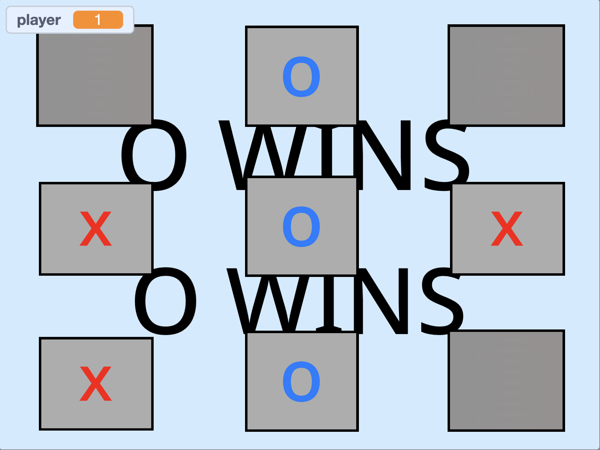
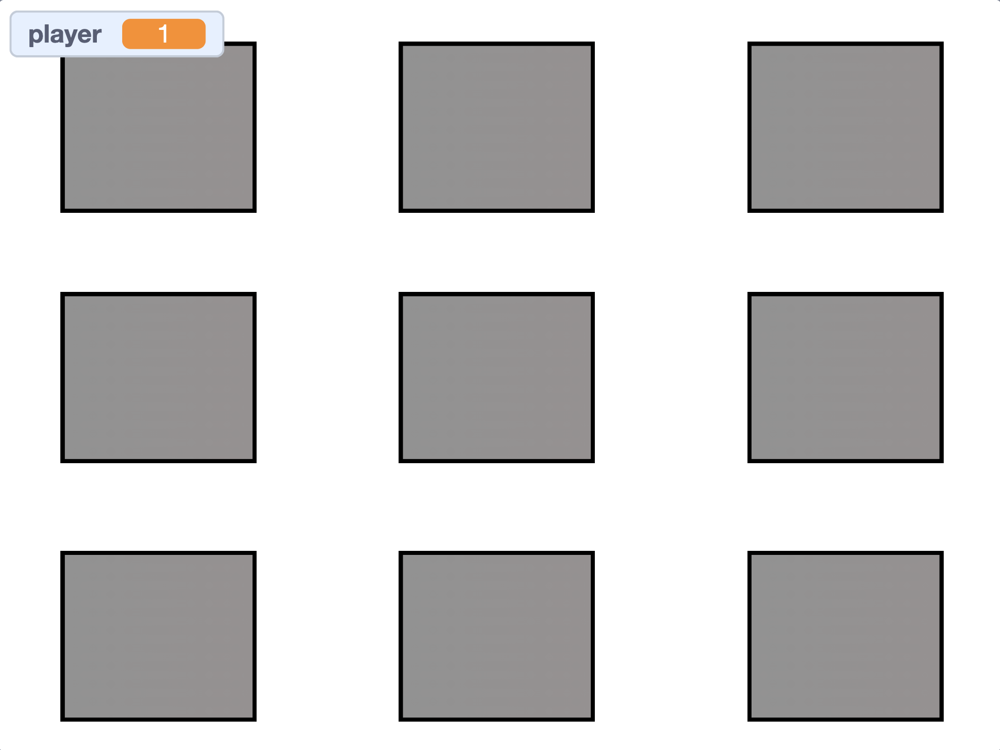
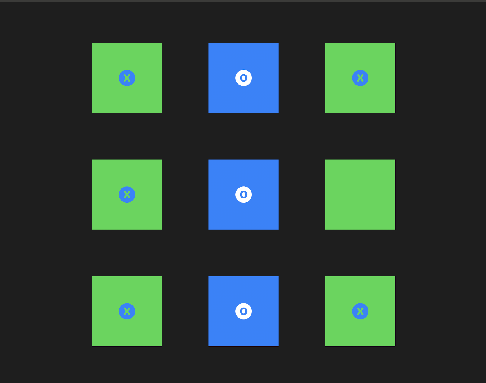
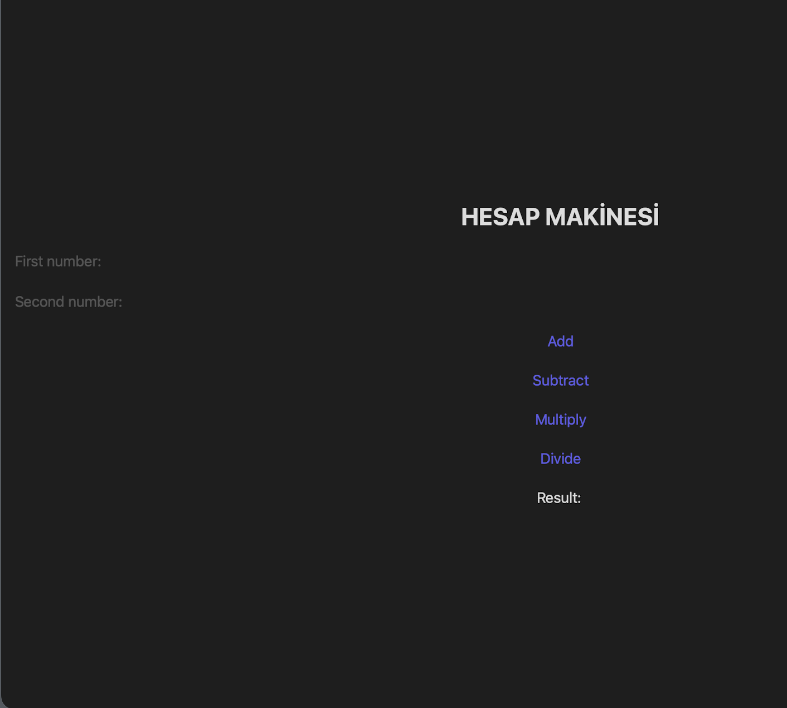
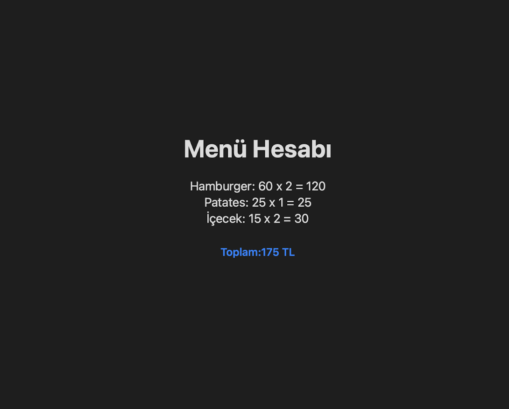
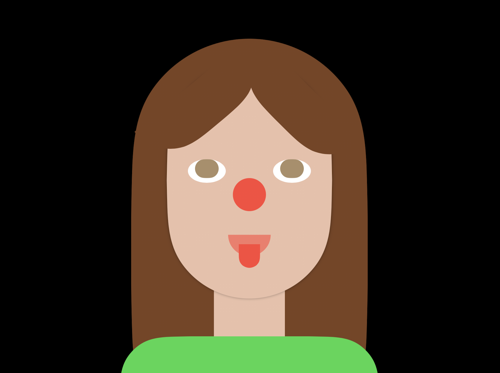
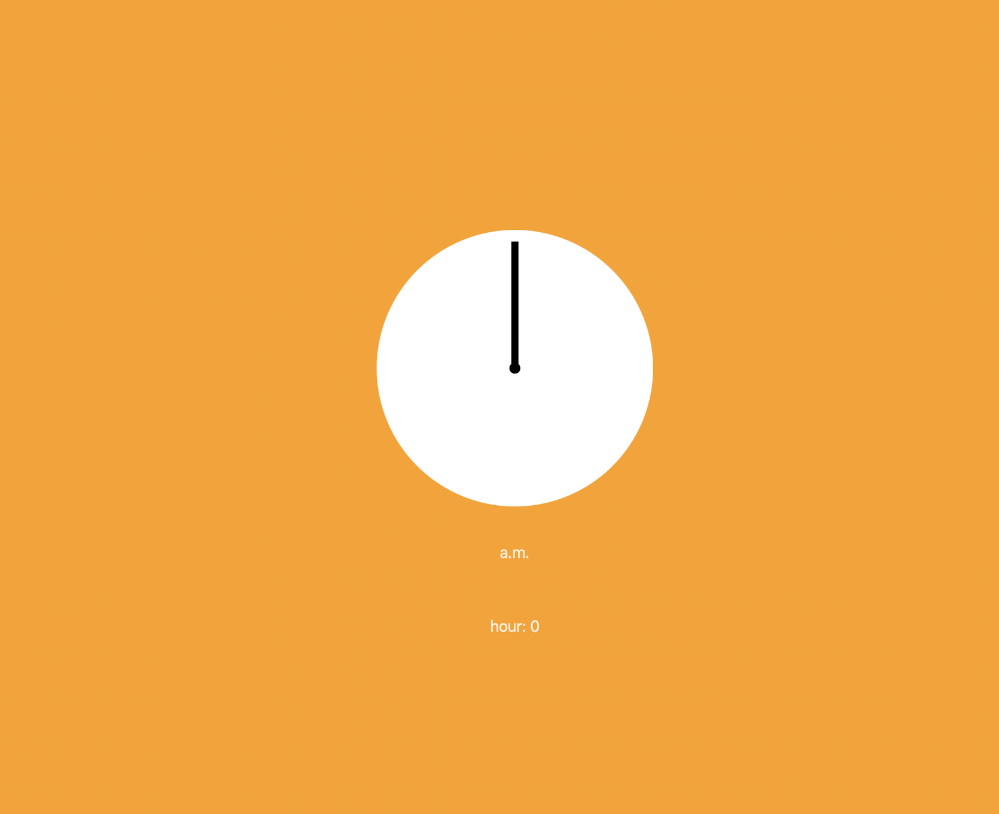
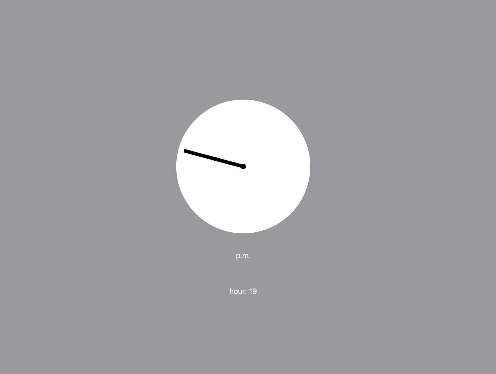

[home](README.md) | **[projects](projects.md)** | [documentation](documentation.md)

# **PROJECTS**

 

## [Scratch](https://github.com/pptbasyurt/pelinbasyurt/tree/main/Projects/Block_Coding)

- *[Tic-Tac-Toe](https://scratch.mit.edu/projects/1212524604)*
  
 

  

 

## [Swift](https://github.com/pptbasyurt/pelinbasyurt/tree/main/Projects/Swift)

- *[X-O-X grid](Projects/Swift/kutu_kutu_pense.swiftpm.zip)*
  
  

-*[Calculator](Projects/Swift/basit_hesap_makinesi.swiftpm.zip)*

 

-*[Menu-Bill](Projects/Swift/menu_hesabi.swiftpm.zip)

-*[My Portrait](Projects/Swift/my_portrait.swiftpm.zip)

-[Clock V1](Projects/Swift/clockv1.zip)

 

  

