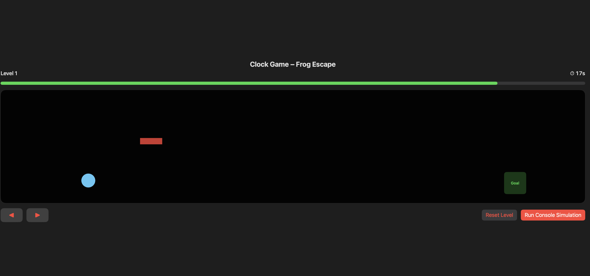
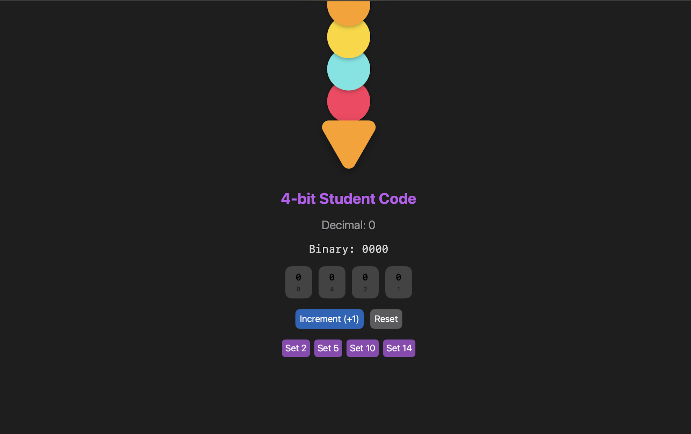

[home](README.md) | [to do](todolist.md) | **[projects](projects.md)** | [documentation](documentation.md) | [big idea](bigidea.md) | [reflections](reflections.md)

  
<strong>PROJECTS</strong>

 

---

<h2><a href="https://scratch.mit.edu/projects/1212524604/">Simple Scratch XOX</a></h2>

  
  
  

 

<h2><a href="https://scratch.mit.edu/projects/1212524604/">Calculator</a></h2>

<em>A simple calculator that gets user input and does the 4 arithmetical equations on them.</em>

  

---

## [Menu Bill](Projects/Swift/basit_hesap_makinesi.swiftpm.zip)

 

---

## [My Portrait](Projects/Swift/basit_hesap_makinesi.swiftpm.zip)

 

---

## [Clock](Projects/Swift/clockv1.zip)

### [Clock V1](Projects/Swift/clockv1.zip)

*A clock that advances on click and changes background color based on whether its a.m. or p.m.*

 

 

### [Clock V2](Projects/Swift/clockv2.zip)

*In addition to the features of Clock V1, the time can be adjusted/set using buttons on screen.*

 

 

### [Clock V3 – Omnitrix](Projects/Swift/bentenwatch.swiftpm.zip)

*Ben 10’s Omnitrix watch that shows the inner mechanisms when you click the switch button.*

 

 

### [Clock Game](Projects/Swift/clockgame1.swiftpm.zip)

*A SwiftUI game where a frog races against a ticking clock, dodging obstacles as each level gets faster.*

 

 

---

## [Binary Conversion](Projects/Swift/basit_hesap_makinesi.swiftpm.zip)

### [Binary Conversion P1](Projects/Swift/binaryv2.zip)

 

 

### [Binary Conversion P2](Projects/Swift/binaryv2.zip)

 

 

### [Icecream Overflow](Projects/Swift/icecream.swiftpm.zip)

An Ice Cream app that teaches binary to decimal conversion numbers through scoops and overflows

 

 

### [Rock Paper Scissors](Projects/Swift/taskagitmakas.swiftpm.zip)

The RockPaperScissorsGame is a simple game where a user competes against the computer. Both select a choice from Rock, Paper, or Scissors, and the game determines the winner based on predefined rules.

 

 

